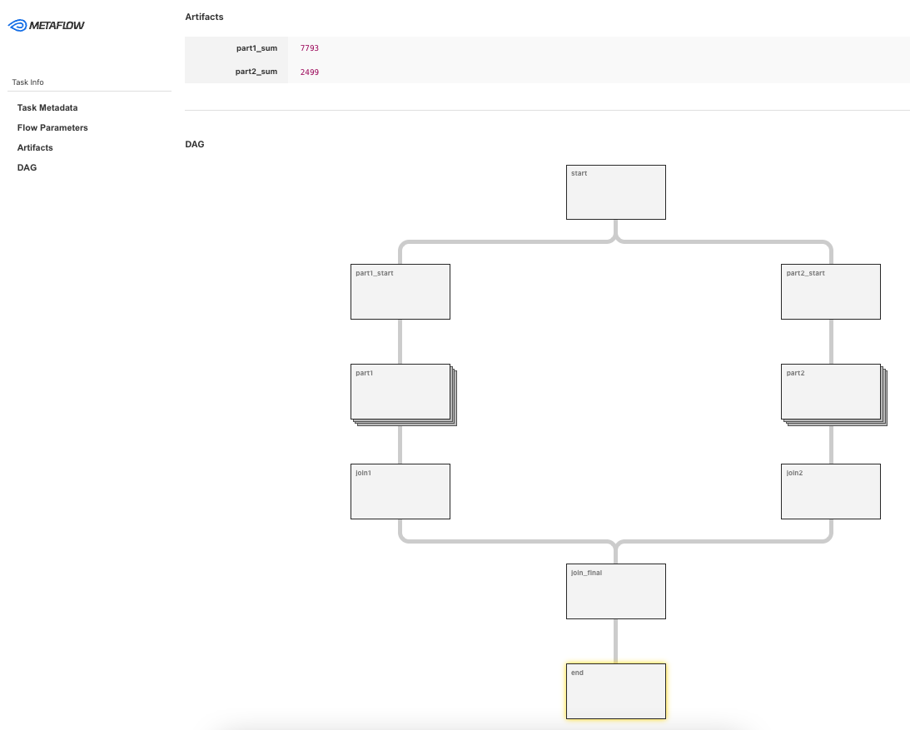

# metaflow-advent-of-code

Over Engineered solutions to the 2022 Advent of Code

using metaflow.org

```
pip install metaflow
```

## Day 3

```
python ./day03.py run --max-num-splits 300
python ./day03.py card view end 
```

  
